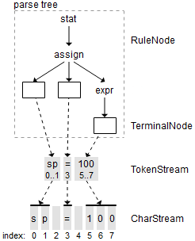
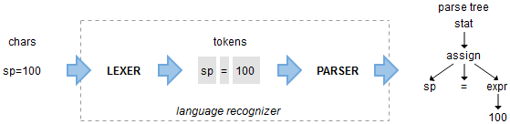

# pl0_compiler

## compiler study note, aim to implement a simple pl0 compiler

The general compiler structure can divide into three parts ignore the difference of language

    1. Tokenizer
    2. Parser
    3. Target Code Generator



The basic data flows likes the picture belows



### Tokenizer

The Tokenizer transform the input file in to a token stream, it should be at least have
two interface

- getToken
- nextToken

The getToken method should get one token from the tokenstream, in order to consume the tokens
which belongs to the current nonterminal symbol.

The nextToken method should allow the parser to look ahead one token in order to select the
different rlues to move on.

In the current finished version in cpp, the tokenizer has two parts

    1. Scanner
    2. Lexer

Scanner transform the source file into char stream, Lexer transform the char stream in to token 
Stream.

### Parser

The parser is core steps of the compile process, in this simple pl0 compiler,
we mainly used recursive descent method.

For each nonterminal symbol, we need to write function which handles
the parsing process for corresponding nonterminal symbol.

```c++
    void program();
    void block();
    void char_declaration();
    void const_declaration();
    void var_declaration();
    void procedure_declaration();
    void statement();
    void condition();
    void expression();
    void term();
    void factor();
```

The start symbol of pl0 language according to it's EBNF form is program, follow with
a terminal symbol '.', which indicate the end of the parsing process.

It calls the block and judge the next symbol is '.' or not.

The block function will consume the tokens which belong to the current block.

Then next thing is the block will call other function according to the EBNF
that compose the block.

### Target Code Generator

The Target Code Generator just like the tokenizer, both of them are called by the
Parser when it needed.

Generally, The Parser 